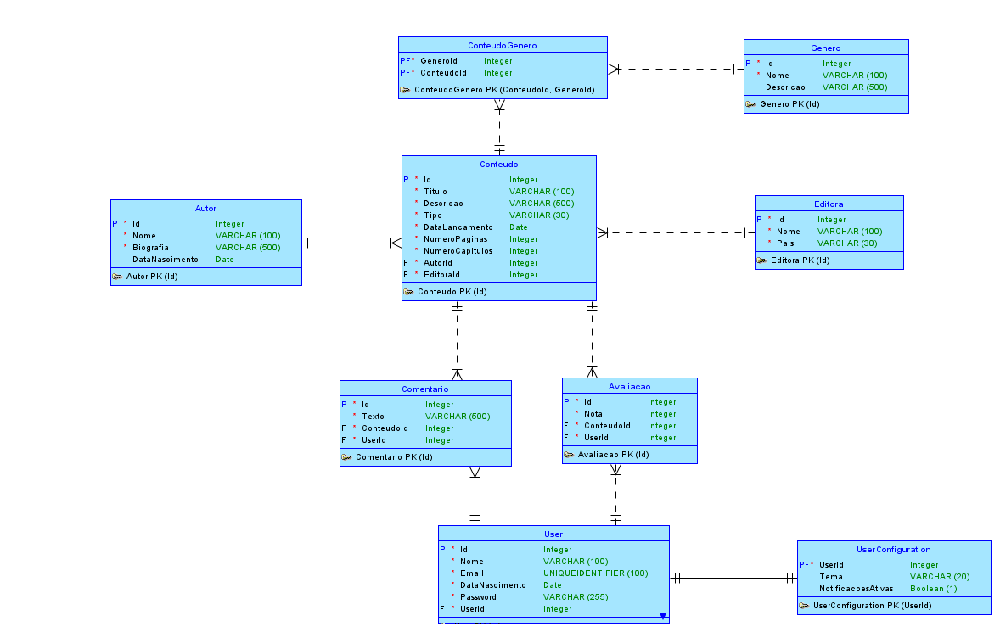
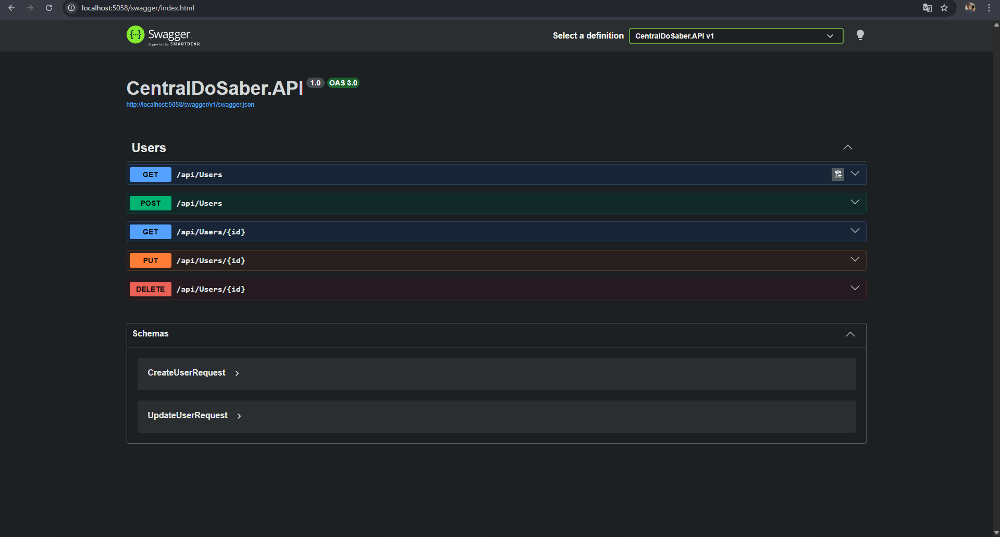
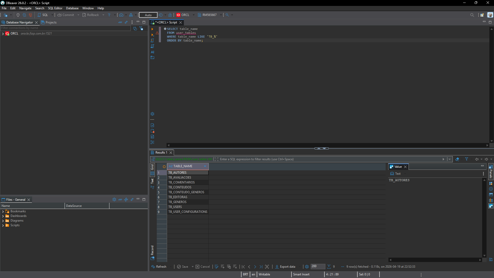

# 📚 Central do Saber

Sistema para gerenciamento e descoberta de conteúdos como **livros, mangás, HQs e revistas**, permitindo que usuários avaliem, comentem e organizem conteúdos.

## 🎯 Objetivo

O projeto **Central do Saber** foi desenvolvido com o objetivo de criar uma plataforma onde usuários possam:

* 📖 cadastrar conteúdos
* ⭐ avaliar conteúdos
* 💬 comentar sobre conteúdos
* 🏷️ classificar conteúdos por gênero
* 👤 gerenciar perfis de usuário

O sistema permite organizar diferentes tipos de mídia e facilitar a descoberta de novos conteúdos.

---

# 🏗️ Arquitetura

O projeto segue princípios de **Domain-Driven Design (DDD)** e separação de responsabilidades em camadas.

Estrutura principal:

```
CentralDoSaber
│
├── Domain
│   ├── Entities
│   ├── Enum
│   └── Common
│
├── Application
│   ├── DTO
│   ├── Interfaces
│   └── Services
│
├── Infrastructure
│   └── Persistence
│       ├── Configurations
│       ├── Migrations
│       └── Repositories
│
└── API
    └── Controllers
```

---

# 🗂️ Modelo Entidade-Relacionamento (MER)

O banco de dados foi modelado utilizando **Oracle SQL Developer Data Modeler**, contendo as seguintes entidades principais:

* User
* UserConfiguration
* Autor
* Editora
* Conteudo
* Genero
* Avaliacao
* Comentario
* ConteudoGenero

### Principais relacionamentos

* **User 1:N Avaliacao**
* **User 1:N Comentario**
* **Conteudo 1:N Avaliacao**
* **Conteudo 1:N Comentario**
* **Autor 1:N Conteudo**
* **Editora 1:N Conteudo**
* **Conteudo N:N Genero**

---

# 🧩 Entidades do Domínio

## Conteudo

Representa o conteúdo principal do sistema.

Atributos principais:

* Titulo
* Descricao
* Tipo (Livro, Manga, HQ, Revista, Outros)
* DataLancamento
* NumeroPaginas
* NumeroCapitulos

Relacionamentos:

* pertence a um **Autor**
* pertence a uma **Editora**
* possui **múltiplos gêneros**
* possui **avaliações**
* possui **comentários**

---

## Autor

Representa o autor responsável pelos conteúdos.

Atributos:

* Nome
* Biografia
* DataNascimento

Relacionamento:

* um autor pode ter vários conteúdos.

---

## Editora

Representa a editora responsável pela publicação do conteúdo.

Atributos:

* Nome
* País

Relacionamento:

* uma editora pode publicar vários conteúdos.

---

## Genero

Classificação temática dos conteúdos.

Atributos:

* Nome
* Descricao

Relacionamento:

* um gênero pode estar associado a vários conteúdos.

---

## Avaliacao

Permite que usuários atribuam notas a conteúdos.

Atributos:

* Nota (1 a 5)

Relacionamentos:

* pertence a um **User**
* pertence a um **Conteudo**

---

## Comentario

Permite que usuários comentem sobre conteúdos.

Atributos:

* Texto

Relacionamentos:

* pertence a um **User**
* pertence a um **Conteudo**

---

## User

Representa os usuários da plataforma.

Atributos:

* Nome
* Email
* DataNascimento
* Password

Relacionamentos:

* pode realizar **avaliações**
* pode realizar **comentários**
* possui **configuração de usuário**

---

## UserConfiguration

Configurações personalizadas do usuário.

Atributos:

* Tema
* NotificacoesAtivas

Relacionamento:

* pertence a um **User**.

---

# 🛠️ Tecnologias Utilizadas

* C#
* .NET 10
* Entity Framework Core
* Domain Driven Design (DDD)
* Clean Architecture
* Oracle SQL Developer Data Modeler
* Git
* GitHub

---

# 📊 Regras de Negócio

Algumas regras implementadas no domínio:

* avaliações devem possuir **nota entre 1 e 5**
* conteúdos devem possuir **ao menos um gênero**
* descrição do conteúdo deve ter **mínimo de 10 caracteres**
* comentários devem possuir **mínimo de 3 caracteres**
* livros, mangás e HQs devem possuir **número de páginas e capítulos**

---

# 🗂️ Modelo Entidade Relacionamento



---

# 🚀 Autores

* Ryan Vetoriano - RM565667 - Github: https://github.com/ryanvetoriano
* Felipe Furlanetto - RM562766 - Github: https://github.com/Felipe-Furlanetto0504

---

# 🗄️ CP2 — Persistência com EF Core

## 🗃️ SGBD utilizado
**Oracle** (`oracle.fiap.com.br`) via provider `Oracle.EntityFrameworkCore`

## 🧱 O que foi implementado

* `DbContext` (`CentralDoSaberContext`) na camada **Infrastructure** com todas as 9 entidades
* Mapeamento completo via **Fluent API** (`IEntityTypeConfiguration<T>`) para cada entidade
* Relacionamentos N:N (`ConteudoGenero`) com chave composta
* Campos `bool` mapeados como `NUMBER(1)` para compatibilidade com Oracle
* **Migration única** (`InitialCreate`) aplicada com sucesso
* Repositórios com interfaces na **Application** e implementações na **Infrastructure**:
    * `IUserRepository` / `UserRepository`
    * `IConteudoRepository` / `ConteudoRepository`
    * `IAutorRepository` / `AutorRepository`
    * `IGeneroRepository` / `GeneroRepository`
* Injeção de dependência registrada no `Program.cs`
* Controller `UsersController` com endpoints CRUD completos

## ⚙️ Como executar

### Pré-requisitos
- .NET 10 SDK instalado
- Acesso à rede da FIAP (ou VPN ativa)

### 1. Configurar credenciais
Crie ou edite o arquivo `CentralDoSaber.API/appsettings.Development.json` com suas credenciais:
```json
{
  "ConnectionStrings": {
    "CentralDoSaberContextOracle": "Data Source=oracle.fiap.com.br:1521/orcl;User ID=SEU_RM;Password=SUA_SENHA;"
  }
}
```

### 2. Aplicar as migrations e criar o banco
```bash
dotnet ef database update --project CentralDoSaber.Infrastructure --startup-project CentralDoSaber.API
```

### 3. Rodar a API
```bash
cd CentralDoSaber.API
dotnet run
```

A documentação interativa estará disponível em:
```
http://localhost:5058/swagger
```

## 📊 Evidência do esquema físico

### Swagger


### Esquema no banco Oracle
