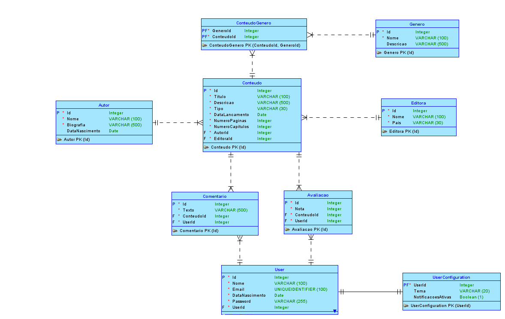
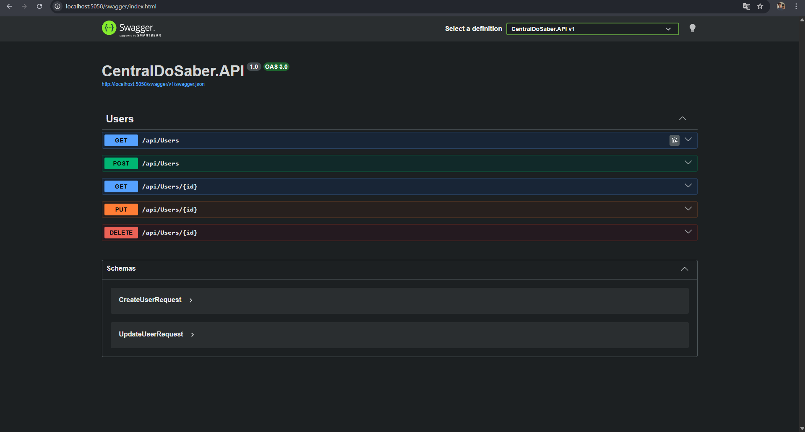
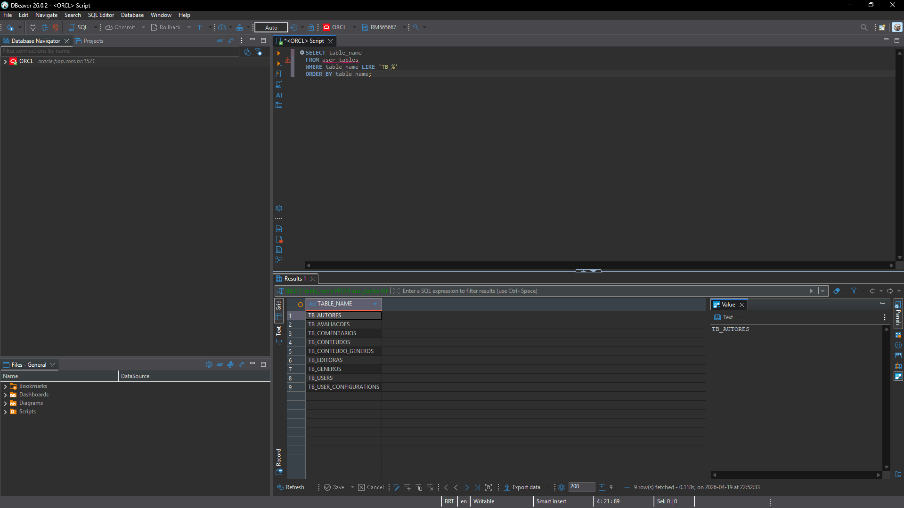
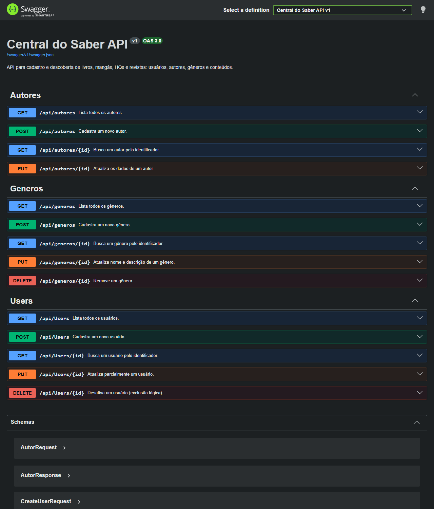
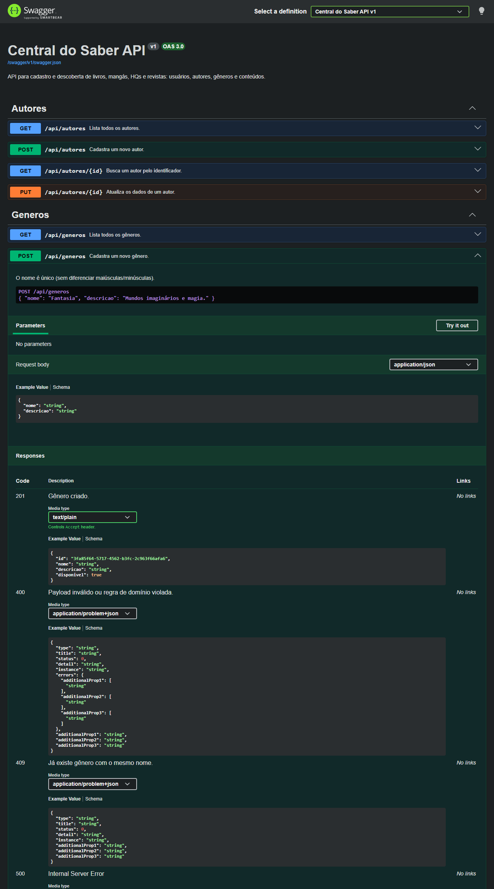
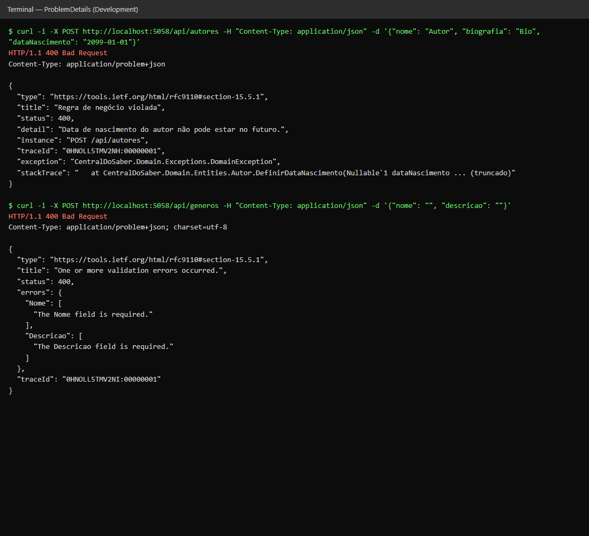
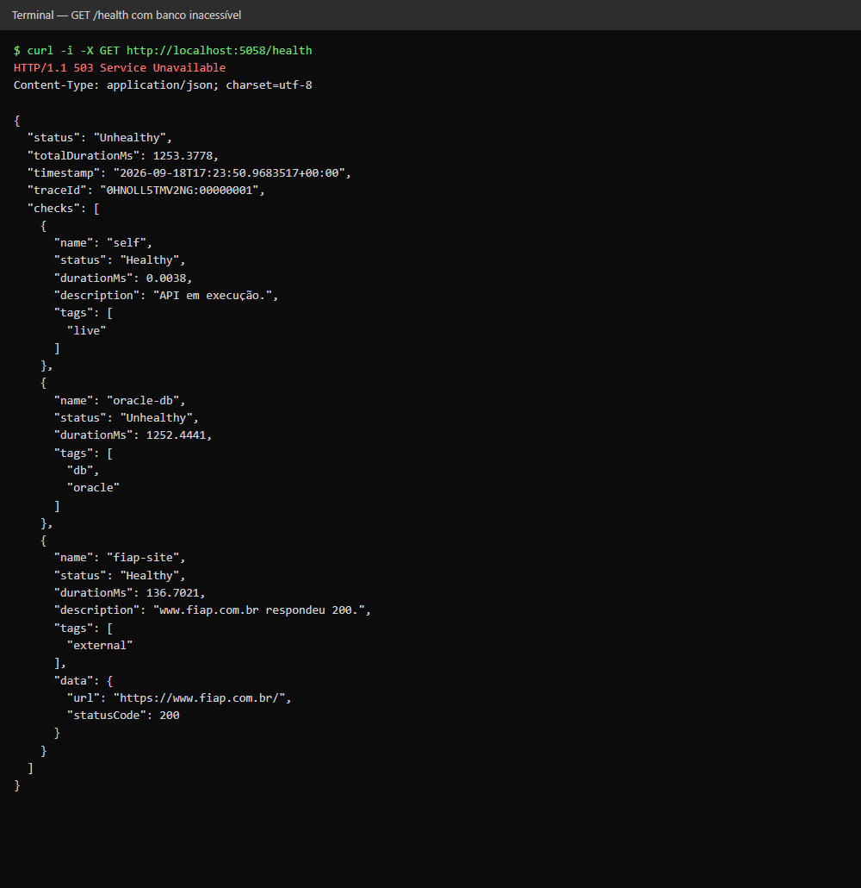
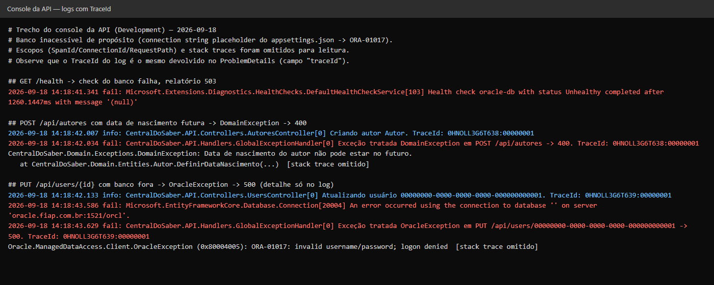
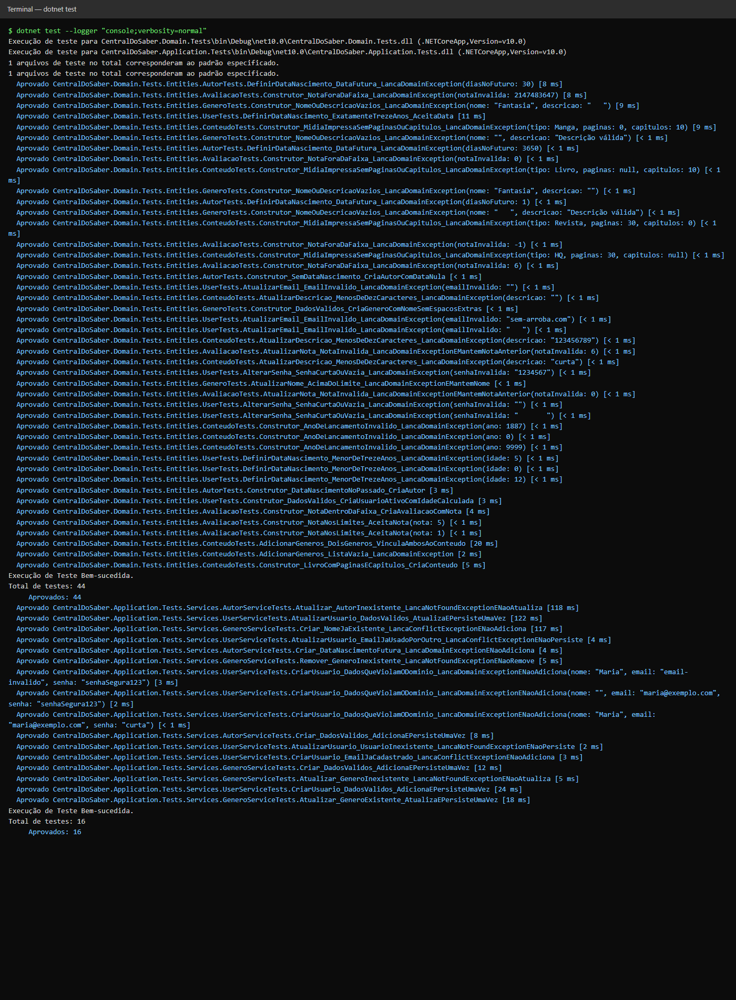

# 📚 Central do Saber

Sistema para gerenciamento e descoberta de conteúdos como **livros, mangás, HQs e revistas**, permitindo que usuários avaliem, comentem e organizem conteúdos.

## 🎯 Objetivo

O projeto **Central do Saber** foi desenvolvido com o objetivo de criar uma plataforma onde usuários possam:

* 📖 cadastrar conteúdos
* ⭐ avaliar conteúdos
* 💬 comentar sobre conteúdos
* 🏷️ classificar conteúdos por gênero
* 👤 gerenciar perfis de usuário

O sistema permite organizar diferentes tipos de mídia e facilitar a descoberta de novos conteúdos.

---

# 🏗️ Arquitetura

O projeto segue princípios de **Domain-Driven Design (DDD)** e separação de responsabilidades em camadas.

Estrutura principal:

```
CentralDoSaber
│
├── Domain
│   ├── Entities
│   ├── Enum
│   └── Common
│
├── Application
│   ├── DTO
│   ├── Interfaces
│   └── Services
│
├── Infrastructure
│   └── Persistence
│       ├── Configurations
│       ├── Migrations
│       └── Repositories
│
├── API
│   ├── Controllers
│   ├── Extensions      (Swagger)
│   ├── Handlers        (GlobalExceptionHandler)
│   └── HealthChecks    (checks, writer JSON, AddCentralDoSaberHealthChecks)
│
├── Domain.Tests        (xUnit, sem mock — referencia só Domain)
└── Application.Tests   (xUnit + Moq — referencia Application)
```

---

# 🗂️ Modelo Entidade-Relacionamento (MER)

O banco de dados foi modelado utilizando **Oracle SQL Developer Data Modeler**, contendo as seguintes entidades principais:

* User
* UserConfiguration
* Autor
* Editora
* Conteudo
* Genero
* Avaliacao
* Comentario
* ConteudoGenero

### Principais relacionamentos

* **User 1:N Avaliacao**
* **User 1:N Comentario**
* **Conteudo 1:N Avaliacao**
* **Conteudo 1:N Comentario**
* **Autor 1:N Conteudo**
* **Editora 1:N Conteudo**
* **Conteudo N:N Genero**

---

# 🧩 Entidades do Domínio

## Conteudo

Representa o conteúdo principal do sistema.

Atributos principais:

* Titulo
* Descricao
* Tipo (Livro, Manga, HQ, Revista, Outros)
* DataLancamento
* NumeroPaginas
* NumeroCapitulos

Relacionamentos:

* pertence a um **Autor**
* pertence a uma **Editora**
* possui **múltiplos gêneros**
* possui **avaliações**
* possui **comentários**

---

## Autor

Representa o autor responsável pelos conteúdos.

Atributos:

* Nome
* Biografia
* DataNascimento

Relacionamento:

* um autor pode ter vários conteúdos.

---

## Editora

Representa a editora responsável pela publicação do conteúdo.

Atributos:

* Nome
* País

Relacionamento:

* uma editora pode publicar vários conteúdos.

---

## Genero

Classificação temática dos conteúdos.

Atributos:

* Nome
* Descricao

Relacionamento:

* um gênero pode estar associado a vários conteúdos.

---

## Avaliacao

Permite que usuários atribuam notas a conteúdos.

Atributos:

* Nota (1 a 5)

Relacionamentos:

* pertence a um **User**
* pertence a um **Conteudo**

---

## Comentario

Permite que usuários comentem sobre conteúdos.

Atributos:

* Texto

Relacionamentos:

* pertence a um **User**
* pertence a um **Conteudo**

---

## User

Representa os usuários da plataforma.

Atributos:

* Nome
* Email
* DataNascimento
* Password

Relacionamentos:

* pode realizar **avaliações**
* pode realizar **comentários**
* possui **configuração de usuário**

---

## UserConfiguration

Configurações personalizadas do usuário.

Atributos:

* Tema
* NotificacoesAtivas

Relacionamento:

* pertence a um **User**.

---

# 🛠️ Tecnologias Utilizadas

* C#
* .NET 10
* Entity Framework Core
* Domain Driven Design (DDD)
* Clean Architecture
* Oracle SQL Developer Data Modeler
* Git
* GitHub

---

# 📊 Regras de Negócio

Algumas regras implementadas no domínio:

* avaliações devem possuir **nota entre 1 e 5**
* conteúdos devem possuir **ao menos um gênero**
* descrição do conteúdo deve ter **mínimo de 10 caracteres**
* comentários devem possuir **mínimo de 3 caracteres**
* livros, mangás e HQs devem possuir **número de páginas e capítulos**

---

# 🗂️ Modelo Entidade Relacionamento



---

# 🚀 Autores

* Ryan Vetoriano - RM565667 - Github: https://github.com/ryanvetoriano
* Felipe Furlanetto - RM562766 - Github: https://github.com/Felipe-Furlanetto0504

---

# 🗄️ CP2 — Persistência com EF Core

## 🗃️ SGBD utilizado
**Oracle** (`oracle.fiap.com.br`) via provider `Oracle.EntityFrameworkCore`

## 🧱 O que foi implementado

* `DbContext` (`CentralDoSaberContext`) na camada **Infrastructure** com todas as 9 entidades
* Mapeamento completo via **Fluent API** (`IEntityTypeConfiguration<T>`) para cada entidade
* Relacionamentos N:N (`ConteudoGenero`) com chave composta
* Campos `bool` mapeados como `NUMBER(1)` para compatibilidade com Oracle
* **Migration única** (`InitialCreate`) aplicada com sucesso
* Repositórios com interfaces na **Application** e implementações na **Infrastructure**:
    * `IUserRepository` / `UserRepository`
    * `IConteudoRepository` / `ConteudoRepository`
    * `IAutorRepository` / `AutorRepository`
    * `IGeneroRepository` / `GeneroRepository`
* Injeção de dependência registrada no `Program.cs`
* Controller `UsersController` com endpoints CRUD completos

## ⚙️ Como executar

### Pré-requisitos
- .NET 10 SDK instalado
- Acesso à rede da FIAP (ou VPN ativa)

### 1. Configurar credenciais
Crie ou edite o arquivo `CentralDoSaber.API/appsettings.Development.json` com suas credenciais:
```json
{
  "ConnectionStrings": {
    "CentralDoSaberContextOracle": "Data Source=oracle.fiap.com.br:1521/orcl;User ID=SEU_RM;Password=SUA_SENHA;"
  }
}
```

### 2. Aplicar as migrations e criar o banco
```bash
dotnet ef database update --project CentralDoSaber.Infrastructure --startup-project CentralDoSaber.API
```

### 3. Rodar a API
```bash
cd CentralDoSaber.API
dotnet run
```

A documentação interativa estará disponível em:
```
http://localhost:5058/swagger
```

## 📊 Evidência do esquema físico

### Swagger


### Esquema no banco Oracle


---

# 🌐 CP3 — API REST, Swagger, Repositório Genérico e Tratamento Global de Erros

## 🧱 O que foi implementado

* **3 recursos REST** com DTOs (nenhuma entidade de domínio é exposta):

| Recurso | Endpoints | Acesso a dados |
|---------|-----------|----------------|
| Usuários | `GET /api/users`, `GET /api/users/{id}`, `POST /api/users`, `PUT /api/users/{id}`, `DELETE /api/users/{id}` (desativa) | `IUserRepository` (específico: busca por e-mail) |
| Gêneros | `GET /api/generos`, `GET /api/generos/{id}`, `POST /api/generos`, `PUT /api/generos/{id}`, `DELETE /api/generos/{id}` | `IRepository<Genero>` (genérico) |
| Autores | `GET /api/autores`, `GET /api/autores/{id}`, `POST /api/autores`, `PUT /api/autores/{id}` | `IRepository<Autor>` (genérico) |

* Controllers enxutos: recebem o DTO, chamam o serviço de aplicação e devolvem `Ok`/`Created`/`NoContent`. **Nenhum controller injeta `DbContext`.**
* Validação leve de entrada com Data Annotations nos DTOs (`[Required]`, `[StringLength]`, `[EmailAddress]`) → 400 automático do `[ApiController]`.

## 📦 Repositório genérico

* Contrato `IRepository<T> where T : BaseEntity` na **Application** ([IRepository.cs](CentralDoSaber.Application/Interfaces/IRepository.cs)):
  `GetAllAsync`, `GetByIdAsync`, `ExistsByIdAsync`, `ExistsAsync(predicado)`, `AddAsync`, `Update`, `Delete`, `SaveChangesAsync`.
* Implementação `Repository<T>` na **Infrastructure** ([Repository.cs](CentralDoSaber.Infrastructure/Persistence/Repositories/Repository.cs)) com `DbContext.Set<T>()` e `AsNoTracking()` nas leituras.
* Registro na DI: `builder.Services.AddScoped(typeof(IRepository<>), typeof(Repository<>));`
* Usado de verdade por `GeneroService` e `AutorService`. Os repositórios específicos do CP2 (`IUserRepository` etc.) continuam onde há consultas além do CRUD.

## 📖 Swagger

* `SwaggerDoc` com título, versão e descrição lidos da seção `Swagger` do `appsettings.json` (extensão `AddCentralDoSaberSwagger`).
* `GenerateDocumentationFile` habilitado em **API** e **Application** → `IncludeXmlComments` mostra os `<summary>`/`<remarks>` dos controllers e DTOs.
* Todas as actions têm `[ProducesResponseType]` para sucesso e erros (400/404/409/500, com `application/problem+json`).
* UI disponível apenas em Development: **http://localhost:5058/swagger**



<details><summary>POST /api/generos expandido (XML comments + tipos de resposta)</summary>



</details>

## 🚨 GlobalExceptionHandler e mapeamento de exceções

`GlobalExceptionHandler` ([Handlers/GlobalExceptionHandler.cs](CentralDoSaber.API/Handlers/GlobalExceptionHandler.cs)) implementa `IExceptionHandler`, registrado com `AddExceptionHandler<GlobalExceptionHandler>()` + `AddProblemDetails()` e ativado por `app.UseExceptionHandler()` antes do Swagger e de `MapControllers`. Toda resposta de erro segue a **RFC 7807** (`application/problem+json`).

| Exceção | Origem | HTTP |
|---------|--------|------|
| `DomainException` | Domain — invariante violada (nota fora de 1–5, senha curta, idade < 13...) | **400** |
| `ArgumentException` | .NET — argumento inválido | **400** |
| Falha de validação do DTO | `[ApiController]` (Data Annotations) | **400** |
| `NotFoundException` | Domain — recurso/dependência inexistente | **404** |
| `KeyNotFoundException` | .NET | **404** |
| `ConflictException` | Domain — conflito de dados (e-mail ou nome de gênero já usado) | **409** |
| Qualquer outra | — | **500** com mensagem genérica |

* Em **Development** o `ProblemDetails` inclui `exception` e `stackTrace` para depuração.
* Em **Production** a resposta só traz `title`, `detail` (mensagem de negócio, ou texto genérico no 500) e `traceId` — **sem stack trace nem detalhe do banco**. O detalhe fica no log.

### Exemplos de chamada

```bash
# Sucesso
curl http://localhost:5058/api/generos
curl -X POST http://localhost:5058/api/generos -H "Content-Type: application/json" -d "{\"nome\":\"Fantasia\",\"descricao\":\"Mundos imaginários e magia.\"}"

# 400 — regra de domínio (data de nascimento futura)
curl -X POST http://localhost:5058/api/autores -H "Content-Type: application/json" -d "{\"nome\":\"Autor\",\"biografia\":\"Bio\",\"dataNascimento\":\"2099-01-01\"}"

# 404 — id inexistente
curl http://localhost:5058/api/generos/00000000-0000-0000-0000-000000000001
```

Mais exemplos em [CentralDoSaber.http](CentralDoSaber.API/CentralDoSaber.http).



---

# 🩺 CP4 — Health Checks, Observabilidade e Testes

## 🔗 URLs (perfil `http`)

| O quê | URL |
|-------|-----|
| Swagger (Development) | http://localhost:5058/swagger |
| Health check | http://localhost:5058/health |

A API sobe igual ao CP3 (`dotnet run` em `CentralDoSaber.API`, credenciais em `appsettings.Development.json`).

## ✅ Health checks — `GET /health`

Registrados via extensão `AddCentralDoSaberHealthChecks` ([HealthChecksExtensions.cs](CentralDoSaber.API/HealthChecks/HealthChecksExtensions.cs)) e mapeados com `MapCentralDoSaberHealthChecks`. `/health` é o **único** endpoint de health e não aparece no Swagger.

| Check | Implementação | O que verifica | Se falhar |
|-------|---------------|----------------|-----------|
| `self` | `SelfHealthCheck` | processo no ar | — (sempre `Healthy`) |
| `oracle-db` | `AddDbContextCheck<CentralDoSaberContext>` — **abordagem (A)** | `Database.CanConnectAsync()` no Oracle com o mesmo `DbContext` do CP2 | **Unhealthy → 503** |
| `fiap-site` | `ExternalUrlHealthCheck` (recomendado) | `GET https://www.fiap.com.br` (timeout 5 s, URL em `HealthChecks:ExternalUrl`) | **Degraded → 200** |

**Por que a abordagem (A)?** Reaproveita o `DbContext` e a connection string já registrados: não há um segundo lugar para configurar o banco, e o check testa exatamente o caminho que a API usa.

**Status HTTP:** `Healthy → 200`, `Degraded → 200`, `Unhealthy → 503`. O status agregado é o **pior** entre os checks: se o banco cair, o relatório inteiro vira `Unhealthy` (503). O site da FIAP foi registrado com `failureStatus: Degraded` de propósito: uma dependência de terceiros fora do ar gera aviso, mas não tira a API de rotação. Se fosse `Unhealthy`, uma queda do site da FIAP derrubaria o `/health` inteiro mesmo com a API e o banco funcionando.

**Resposta JSON** (writer próprio em [HealthCheckResponseWriter.cs](CentralDoSaber.API/HealthChecks/HealthCheckResponseWriter.cs)): `status`, `totalDurationMs`, `timestamp`, `traceId` e `checks[]` com `name`, `status`, `durationMs`, `description`, `tags`, `data`. O campo `exception` só aparece em Development.

### Validação

* **Banco inacessível → 503**: evidência real em [docs/evidencias/health-unhealthy-banco-inacessivel.json](docs/evidencias/health-unhealthy-banco-inacessivel.json), obtida subindo a API só com a connection string placeholder do `appsettings.json` (sem `appsettings.Development.json`), o que gera `ORA-01017` no Oracle.

  
* **Tudo ok → 200**: com as credenciais reais em `appsettings.Development.json`, `/health` retorna os três checks `Healthy` e HTTP 200.

## 📝 Observabilidade — logs com `traceId`

* `ILogger<T>` nativo, console em linha única com timestamp e escopos (`AddSimpleConsole`).
* **Fluxos de escrita** (`POST`/`PUT` de usuários, gêneros e autores) logam **início** e **sucesso** com propriedades nomeadas, sem concatenação de string:
  ```csharp
  _logger.LogInformation("Criando gênero {GeneroNome}. TraceId: {TraceId}", request.Nome, traceId);
  ```
  A senha do usuário **nunca** é logada.
* **GlobalExceptionHandler** loga toda exceção em nível **Error** com `{ExceptionType}`, `{Method}`, `{Path}`, `{StatusCode}` e `{TraceId}`.
* O mesmo `HttpContext.TraceIdentifier` vai no campo `traceId` do `ProblemDetails` (configurado em `AddProblemDetails(... CustomizeProblemDetails ...)`), então quem recebe um erro consegue achar a linha exata no log.

Trecho real do console: [docs/evidencias/logs-console.txt](docs/evidencias/logs-console.txt).



## 🧪 Testes (xUnit)

| Projeto | Referencia | Estratégia |
|---------|-----------|------------|
| `CentralDoSaber.Domain.Tests` | **somente** Domain | entidades reais, **sem mock**: AAA, `[Fact]` + `[Theory]/[InlineData]` |
| `CentralDoSaber.Application.Tests` | Application (Domain indireto) | serviços com **Moq** nas interfaces de repositório (`IUserRepository`, `IRepository<Genero>`, `IRepository<Autor>`); não sobe API nem banco |

Pacotes: `xunit`, `xunit.runner.visualstudio`, `Microsoft.NET.Test.Sdk`, `coverlet.collector` e `Moq` (Application).

**Domínio (regras reais do MER):** nota da avaliação entre 1 e 5; usuário com 13+ anos, e-mail válido e senha com 8+ caracteres; conteúdo com descrição de 10+ caracteres, ano de lançamento válido, páginas/capítulos para mídias impressas e ao menos um gênero; gênero com nome obrigatório (até 100 caracteres); autor sem data de nascimento futura.

**Application:** dependência ausente (usuário/gênero/autor inexistente) → `NotFoundException` **e** `Update`/`Delete`/`SaveChangesAsync` com `Times.Never`; e-mail/nome duplicado → `ConflictException` sem `AddAsync`; caminho feliz persiste com `Times.Once`.

Nomes no padrão `MetodoOuCenario_Condicao_ResultadoEsperado`, ex.: `AtualizarUsuario_UsuarioInexistente_LancaNotFoundExceptionENaoPersiste`.

### Como rodar

Na raiz (onde está o `CentralDoSaber.sln`):

```bash
dotnet test
```

Resultado atual: **60 testes, 60 aprovados** (44 Domain + 16 Application). Saída completa em [docs/evidencias/dotnet-test.txt](docs/evidencias/dotnet-test.txt).

<details><summary>Print do dotnet test</summary>



</details>